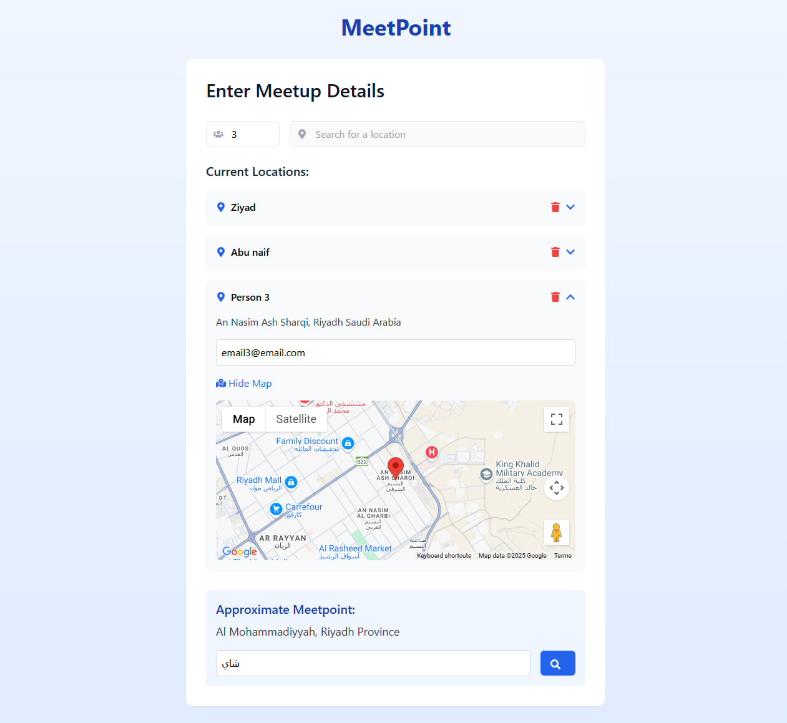
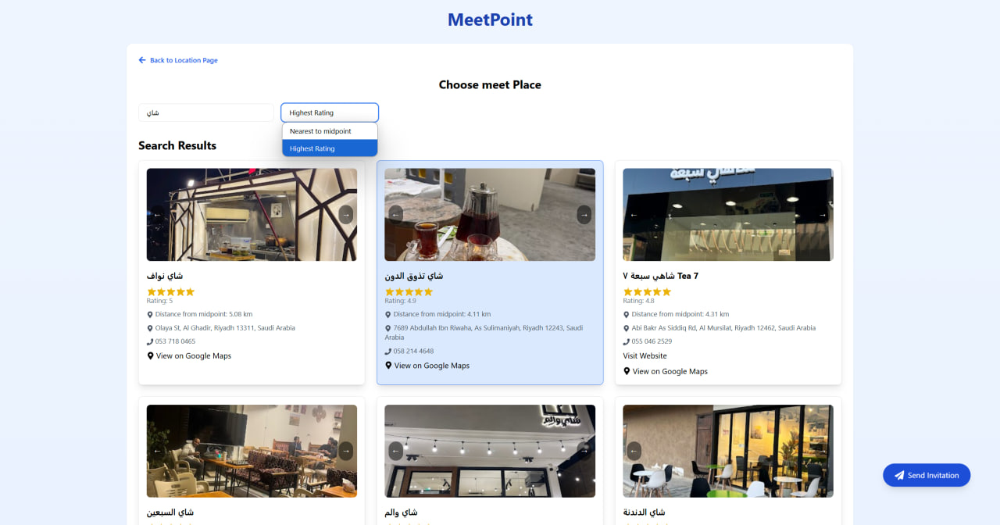

# MeetPoint

MeetPoint is a simple and efficient solution for finding the ideal meet-up point for you and your friends in a city with heavy traffic, like Riyadh. When trying to meet with friends who live in different locations (e.g., District X, District Y, and District Z), finding a convenient meeting spot can be a challenge. 

-------------------------

With MeetPoint, you simply:
1. Enter the locations of all participants.
2. Specify the type of place you want to meet at (e.g., "tea", "metro", "theater", etc.).
3. MeetPoint will find the ideal midpoint for all participants.
4. Optionally, you can add participants' emails to send them invitations so that it appears in their calendars, ensuring no one forgets.

## Features
- **Location Input:** Add the location of each participant with Google Maps autocomplete.
- **Midpoint Calculation:** Automatically find the midpoint for all entered locations.
- **Search for Places:** Search for specific places (e.g., cafes, parks, restaurants) around the midpoint.
- **Filter Results:** Filter search results based on rating and price level.
- **Invitation System:** Send email invitations to participants, including calendar invites.
- **Save and Load Data:** Automatically saves user inputs to local storage for convenience.

## Tech Stack
- React (via Vite)
- React Router
- TailwindCSS
- Google Maps API
- Node.js (Express)
- Mailgun (for sending invitation emails)
- Axios (for making API requests)
- ICS (for creating calendar events)
